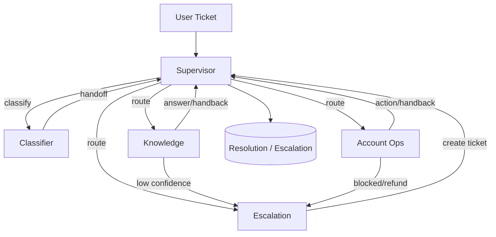

## Multi‑Agent Customer Support Architecture (Supervisor Pattern)

### Overview
The system uses LangGraph’s Supervisor pattern to orchestrate specialized agents for customer support. A central Supervisor routes tickets to the most appropriate agent, collects results, and ensures completion or escalation.

### Agents and Responsibilities
- **Classifier**: Classifies incoming tickets by category and urgency, extracts keywords, and suggests the next agent.
- **Knowledge**: Searches the knowledge base using tools and answers from articles. Escalates when confidence is low.
- **Account Ops**: Performs account lookups, subscription checks, and reservation management via tools. Escalates when blocked/refund or risky actions.
- **Escalation**: Creates escalation tickets with a clear summary and context for human agents.

### Escalation Agent (Details)
- **Triggers**:
  - Confidence from knowledge retrieval < 0.5 or no relevant articles found
  - Refund/charge dispute language
  - Blocked or risky account flags from account tools
  - Critical urgency or repeated failures across agents
- **Actions**:
  - Summarize the issue, attempted steps, and urgency
  - Create escalation via `create_escalation_ticket`
  - Hand back to Supervisor with escalation confirmation
- **Outputs**:
  - Human-readable confirmation for the customer
  - Structured escalation ticket in the core DB

### Data and Tools
- Databases: `cultpass.db` (external) and `udahub.db` (core). ORM via SQLAlchemy.
- Tools:
  - Knowledge tools: `search_knowledge_base`, `get_article_by_id`, `list_knowledge_categories`.
  - Account tools: `lookup_user_account`, `check_subscription_status`, `get_user_reservations`, `cancel_reservation`, `update_subscription_status`.
  - Escalation tool: `create_escalation_ticket`.

### Memory and State
- Short‑term memory: LangGraph `MemorySaver` checkpointer with `thread_id` for per‑ticket sessions.
- Long‑term memory: Stored in core DB (ticket history, preferences). Accessed via memory tools or manager.

#### State Management
Unified state structure (`SupportTicketState`) flows between steps and accumulates context and decisions:
- Messages (LangGraph history)
- Ticket info (ticket_id, user_id, channel)
- Classification (category, urgency, keywords, recommended_agent)
- Knowledge (articles, confidence)
- Account (user_data, subscription_data, user_is_blocked)
- Tracking (agents_called, tools_used, current_step)
- Decisions (requires_escalation, escalation_reason, can_auto_resolve)
- Resolution (status, final_response, resolution_summary)
Validation helpers ensure consistent state; `should_escalate(state)` gates escalation.

### Routing Logic (High‑Level)
1. Supervisor receives a ticket.
2. Supervisor may call Classifier to determine category/urgency or directly route based on content.
3. If informational → Knowledge; if account/subscription/reservations → Account Ops; if complex/blocked/refund → Escalation.
4. Agents may handoff back to Supervisor; Supervisor decides next step or finish.

### Diagram

### Flow of Information & Decision‑Making
1. User ticket and metadata arrive (text, user_id, channel).
2. Supervisor classifies or routes directly based on content and prior context (long‑term memory).
3. Knowledge Agent retrieves articles; if confidence < threshold, recommends escalation.
4. Account Ops Agent performs DB-backed operations; flags blocked/refund → escalation.
5. Escalation Agent creates a structured ticket and confirms handoff.
6. Supervisor finalizes: returns grounded assistant response or escalation confirmation.
7. Memory tools persist messages and status updates for future personalization.

### Inputs & Outputs
- **Inputs**:
  - text (required): ticket content
  - user_id (required): external user identifier
  - ticket_id / thread_id (required): session identifier
  - channel (optional): chat/email/other
  - metadata (optional): urgency hints, category hints
- **Outputs**:
  - assistant_message (resolved) grounded in KB or tool results, or
  - escalation_confirmation with ticket reference
  - logs for routing, tools, decisions (JSON to `logs/agentic.log`)

### Design Guarantees
- Deterministic routing via Supervisor.
- Transparent handoffs with back‑handoff messages.
- Inspectable session via `thread_id` and checkpointer.

### Alignment With Rubric
- Pattern: Supervisor with 4 specialized agents.
- Routing decisions based on classification and ticket content.
- Knowledge retrieval with confidence and escalation.
- Tooling abstracts DB operations.
- Memory via checkpointer and persistent DB.
