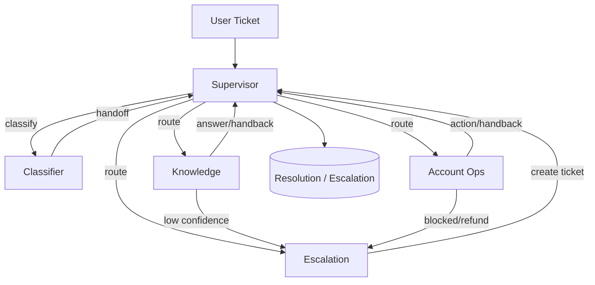

## Multi‑Agent Customer Support Architecture (Supervisor Pattern)

### Overview
Supervisor routes tickets to specialized agents, monitors progress, and ensures resolution or escalation.

### Agents
- **Classifier**: Categorizes and prioritizes tickets; suggests next agent.
- **Knowledge**: Retrieves KB articles and composes answers; escalates on low confidence.
- **Account Ops**: Performs account/subscription/reservation operations via tools; escalates when blocked/refund.
- **Escalation**: Creates human escalation tickets with clear summaries and urgency.

### Tools and Data
- Knowledge: `search_knowledge_base`, `get_article_by_id`, `list_knowledge_categories`.
- Account: `lookup_user_account`, `check_subscription_status`, `get_user_reservations`, `cancel_reservation`, `update_subscription_status`.
- Escalation: `create_escalation_ticket`.
- Databases: `cultpass.db` (external), `udahub.db` (core).

### Memory
- Session memory via LangGraph `MemorySaver` with `thread_id`.
- Long‑term memory through DB (ticket history, preferences).

### Flow (Mermaid)

### I/O
- Input: Ticket text + optional metadata (user_id, channel, urgency).
- Output: Final assistant message or escalation confirmation.

### Rubric Alignment
- Supervisor pattern with 4 agents.
- Task routing + classification.
- Knowledge retrieval with escalation logic.
- DB‑abstracted tools.
- Session memory and persistent history.

# UDA-Hub Multi-Agent Architecture

## System Purpose
Intelligent customer support ticket resolution system for CultPass using multi-agent orchestration with LangGraph.

## Design Pattern
Supervisor Pattern with Specialized Workers

## Key Design Decisions
- **Why supervisor pattern?** [explain your reasoning]
- **How many agents?** [explain your choice]
- **What triggers escalation?** [define criteria]

---

## Agent 1: Supervisor/Orchestrator

**Role:** Receives ticket, routes to appropriate worker, aggregates responses

**Decision criteria:**
- Analyzes ticket content for keywords
- Checks ticket metadata (urgency, user history)
- Determines which specialist(s) to call
- **Does NOT:** Directly resolve issues (delegates to workers)

---

## Agent 2: Classifier Agent (optional but recommended)

**Role:** Analyzes ticket and extracts:
- Issue category (technical, billing, account, reservation)
- Urgency level (low, medium, high, critical)
- Required actions (lookup, modify, escalate)

**Output:** Structured classification data for routing

**Tools:** None (pure LLM reasoning)

---

## Agent 3: Knowledge Retrieval Agent

**Role:** Searches knowledge base for relevant articles

**Tools:**
- `search_knowledge_base(query, tags)` - finds articles

**Logic:**
- Performs semantic/keyword search
- Scores relevance/confidence
- If confidence > 0.7: returns article-based response
- If confidence < 0.7: signals need for escalation

**Output:** Response text OR escalation flag

---

## Agent 4: Account Operations Agent

**Role:** Performs database lookups and operations

**Tools:**
- `lookup_user_account(user_id)` - get user details
- `check_subscription_status(user_id)` - subscription info
- `get_user_reservations(user_id)` - active bookings
- `cancel_reservation(reservation_id)` - cancel booking
- `update_subscription(user_id, action)` - pause/cancel sub

**Logic:** Executes when supervisor determines data lookup/action needed

**Output:** Structured data or action confirmation

---

## Agent 5: Escalation Agent

**Role:** Handles cases requiring human intervention

**Triggers:**
- No knowledge article found
- Confidence too low
- User account blocked
- Refund requests (policy exception)
- Security concerns

**Actions:**
- Logs escalation reason
- Summarizes ticket for human agent
- Updates ticket status to "escalated"

**Output:** Escalation summary

## State Management

### Workflow State Schema
class SupportTicketState(MessagesState):
    # Ticket Information
    ticket_id: str
    user_id: str
    ticket_content: str
    channel: str  # chat, email, phone
    
    # Classification Results
    issue_category: Optional[str]  # technical, billing, etc.
    urgency_level: Optional[str]   # low, medium, high, critical
    
    # Knowledge Retrieval
    retrieved_articles: Optional[List[Dict]]
    confidence_score: Optional[float]
    
    # Account Data
    user_account_data: Optional[Dict]
    
    # Decision Tracking
    current_agent: Optional[str]
    agents_called: List[str]
    tool_calls_made: List[Dict]
    
    # Resolution
    resolution_status: str  # pending, resolved, escalated
    final_response: Optional[str]
    escalation_reason: Optional[str]

    ## State Management

### Workflow State Schema
class SupportTicketState(MessagesState):
    # Ticket Information
    ticket_id: str
    user_id: str
    ticket_content: str
    channel: str  # chat, email, phone
    
    # Classification Results
    issue_category: Optional[str]  # technical, billing, etc.
    urgency_level: Optional[str]   # low, medium, high, critical
    
    # Knowledge Retrieval
    retrieved_articles: Optional[List[Dict]]
    confidence_score: Optional[float]
    
    # Account Data
    user_account_data: Optional[Dict]
    
    # Decision Tracking
    current_agent: Optional[str]
    agents_called: List[str]
    tool_calls_made: List[Dict]
    
    # Resolution
    resolution_status: str  # pending, resolved, escalated
    final_response: Optional[str]
    escalation_reason: Optional[str]
ser_id (str)
- **Output**: List of reservations with experience details
- **Database**: cultpass.db -> reservations + experiences

### cancel_reservation
- **Purpose**: Cancel a reservation
- **Input**: reservation_id (str)
- **Output**: Success/failure + confirmation
- **Database**: cultpass.db -> update reservation status

## 4. Subscription Management Tools

### update_subscription_status
- **Purpose**: Pause or cancel subscription
- **Input**: subscription_id (str), action ('pause'|'cancel')
- **Output**: Updated subscription object
- **Database**: cultpass.db -> subscriptions